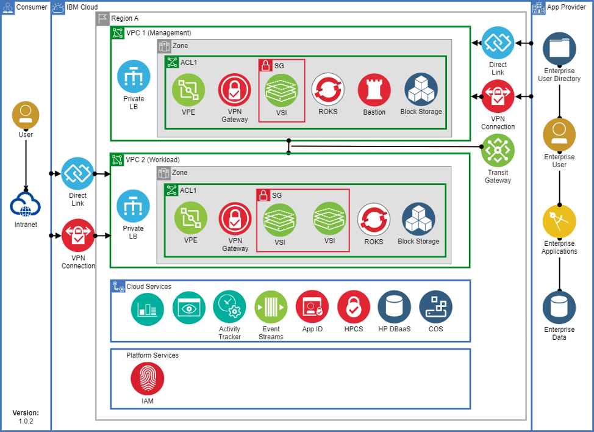

# IBM Cloud for Financial Cloud Services Framework

The IBM Cloud Financial Cloud Services Framework provides comprehensive and detailed guidance to help address the needs of enterprises with regulatory compliance, security, and resiliency during the initial deployment phase and with ongoing operations. More details can be found at: [Getting started with IBM Cloud for Financial Services](https://cloud.ibm.com/docs/framework-financial-services?topic=framework-financial-services-about)

Whilst the framework was initially based on the needs of financial institutions, as its name indicates, it can be used as a starting point and baseline for meeting compliance and security for most industries.

The framework provides secure [VPC reference architectures](https://cloud.ibm.com/docs/framework-financial-services?topic=framework-financial-services-vpc-architecture-about) meeting with a number of regulatory controls.

