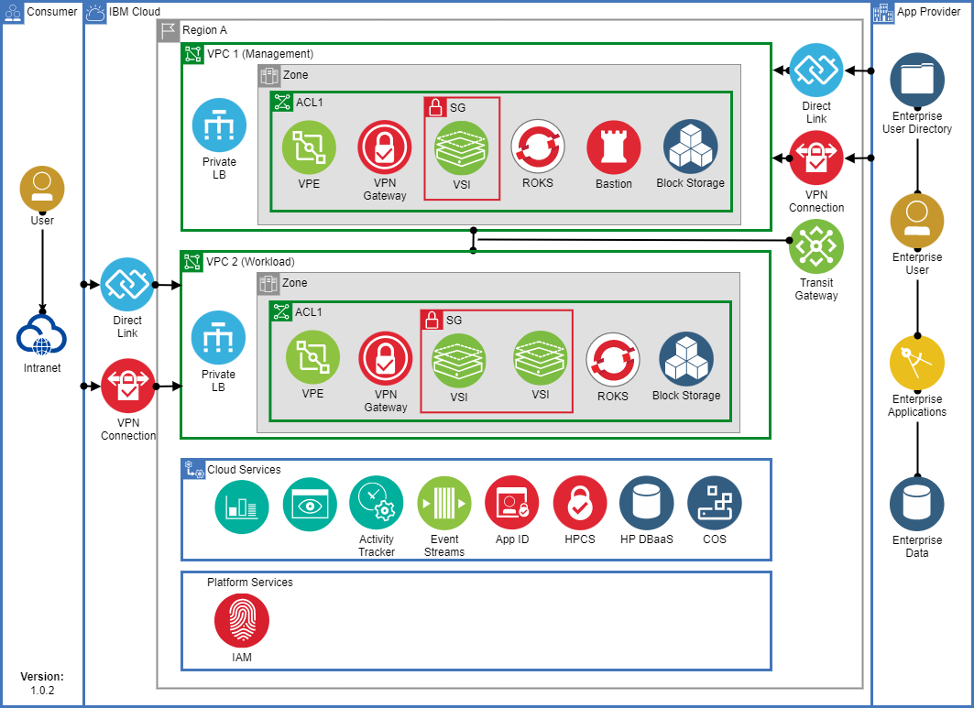

# VPC Landing Zone

IBM VPC Landing Zone (“SLZ”) is a set of [Infrastructure-As-Code](https://en.wikipedia.org/wiki/Infrastructure_as_code) automation that enables creating a fully customizable VPC environment within a single region. The VPC Landing Zone is implemented in terraform and automates the provisioning, configuring, and integration of several services that participates in the realization of a compliant VPC-based topology:

- A resource group for cloud services and for each VPC.
- Cloud Object Storage instances for flow logs and Activity Tracker
- Encryption keys in either a Key Protect or Hyper Protect Crypto Services instance
- A management and workload VPC connected by a transit gateway
- A flow log collector for each VPC
- All necessary networking rules to allow communication.
- Virtual Private Endpoint (VPE) for Cloud Object Storage in each VPC
- A VPN gateway in the management VPC

[Available VPC Landing Zone terraform modules](https://github.com/terraform-ibm-modules/terraform-ibm-landing-zone)

VPC Landing Zone comes with four fully functional patterns that are strictly following the IBM Cloud Financial Services reference architecture:

- VPC pattern
- VPC with Virtual Servers (“VSIs”) – which the lab will use.
- VPC with OpenShift
- VPC with VSIs and OpenShift (“mixed”) pattern.

Each of the patterns can be used as a starting point to create your own customizable VPC-based topology that matches your enterprise or customer exact needs.

