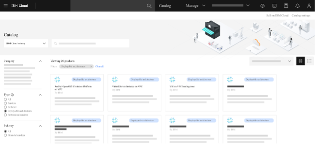

# Deployable architecture

A deployable architecture is defined as "Cloud automation for deploying a common architectural pattern that combines one or more cloud resources that is designed for easy deployment, scalability, and modularity.

From a technical perspective, deployable architectures are essentially Terraform modules that are fully integrated into the IBM Cloud experience. Deployable architectures have these characteristics:

- Discoverable and available through the IBM Cloud catalog (and through IBM Cloud search)
- Fully integrated in IBM Cloud projects and Schematics
- Integrated with [IBM Cloud Risk Analyzer](https://cloud.ibm.com/docs/code-risk-analyzer-cli-plugin?topic=code-risk-analyzer-cli-plugin-cra-cli-plugin#terraform-command)

In other words, a user can run the Terraform automation behind a deployable architecture just from a few clicks and inputs in the IBM Cloud console.

The Landing Zone Terraform module and patterns that are described in [🌍 VPC Landing Zone](./about/20-vpc-landing-zone.md) have a corresponding [deployable architecture](https://cloud.ibm.com/docs/secure-infrastructure-vpc?topic=secure-infrastructure-vpc-overview) in IBM Cloud. To help you learn about deployable architectures, this lab provides steps for the deployable architecture in IBM Cloud rather than by running Terraform commands against the open source GitHub version.

IBM-maintained deployable architectures are just like the Landing Zone deployable architecture in these ways:

- Provide the same level of customer support as any other IBM Cloud product
- [Come with extensive documentation](https://cloud.ibm.com/docs/secure-infrastructure-vpc?topic=secure-infrastructure-vpc-overview)
- Are maintained to be current over time
