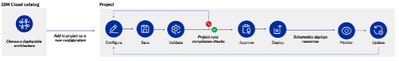

# IBM Cloud Projects

IBM Cloud Projects make it easy to manage Infrastructure-As-Code deployments across accounts, collaborate with team members, and maintain compliance.

At its core, an IBM Cloud Project is made up of a collection of configurations that are used to manage related Infrastructure as Code (IaC) deployments (and associated resources) across accounts.

As a concrete example, let’s imagine the scenario of a SRE team responsible for setting up the infrastructure supporting the web application. That SRE team wants to follow best practices and deploy the following environments, all based on the same Deployable Architecture template (but with slight configuration differences for each environment):

1. A development environment – with scaled down compute resources and no audit event tracking.
2. A staging environment – as close as possible to the production environment
3. 2 production environments: one in America and another one in Europe.

That SRE team can group configurations, and thus centralize the governance, for the 4 different environments in one single Project.

Beyond the core configuration grouping capability, IBM Cloud Projects is designed with an IaC and a compliance-first approach. Projects also seemingly integrate with IBM Cloud Schematics to deploy, update, and manage the resources created by the IaC automation.
Each project also includes tools to scan for potentially harmful resource changes, compliance, security, and cost, as well as tracking configuration versioning and governance.

