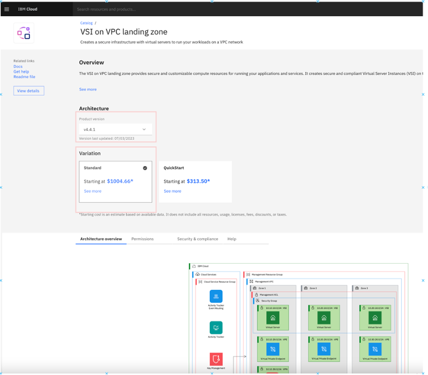
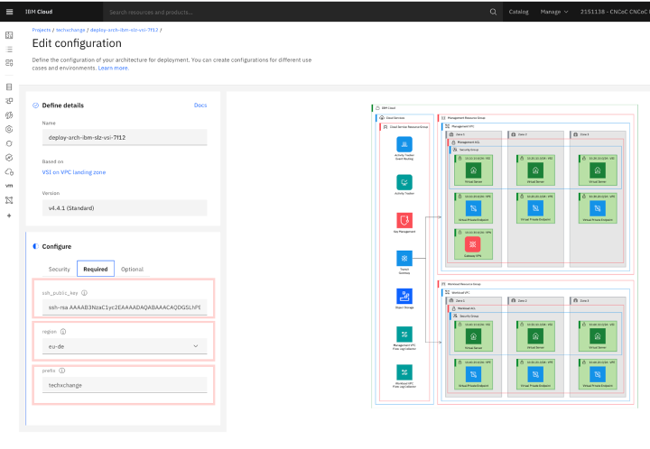
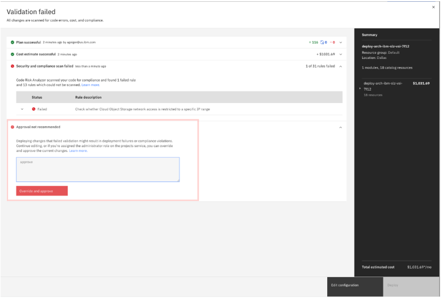

# Deploying Landing Zone VSI pattern through IBM Cloud Project

1. Create an ssh-key on your laptop via the command:\
   `ssh-keygen -t rsa -b 4096 -N '' -f ./lab-key`\
   This command generates two files in the current directory: ‘lab-key’ (the private key) and ‘lab-key.pub’ (the public key).
2. Access the VSI on VPC landing zone Deployable Architecture
3. On the Overview page, make sure the following is selected:\
   a. Product version: 4.4.1\
   b. Variation: Standard
   
4. Click **Review deployment options**
5. Click **Add to project**
6. Under _Create New_, input a name that you wish to provide to the project
7. Click _Add_ on the bottom right
8. Under _Configure->Security_ section, set the following:\
   a. Authentication: <Can we generate one or have in secrets manager instance for them> TODO

9. Under _Configure->Required_ section, set the following:\
   a. ssh_public_key: The value of lab-key.pub that was generated from step 1\
   b. Region: Select a region that you wish to deploy in\
   c. Prefix: your initials
   

10. Under Configure-> Optional, set the following:\
    a. add_atracker_route: false
11. Click Save
12. Click Validate
13. The project will go through different steps in validation. When it completes, the validation will fail due to a rule within the Security and compliance section. In the Approval not recommended section, add a comment and click Override and approve to start provisioning.

