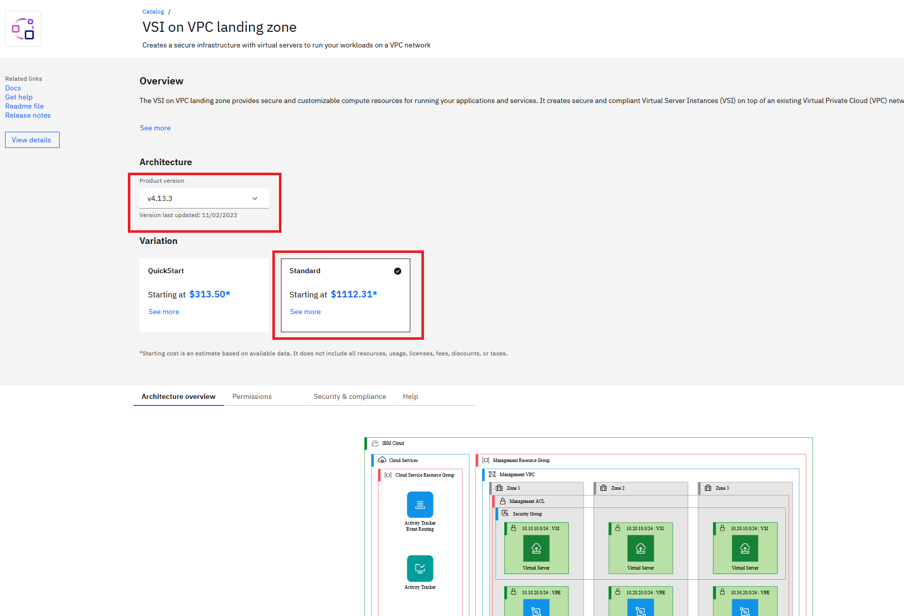
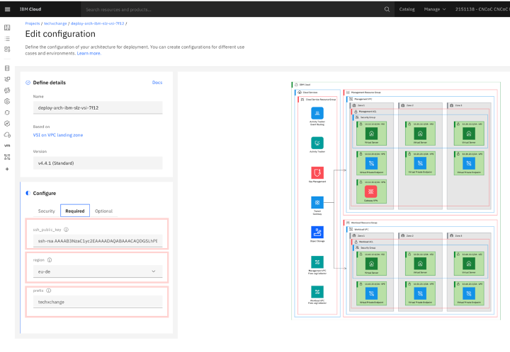
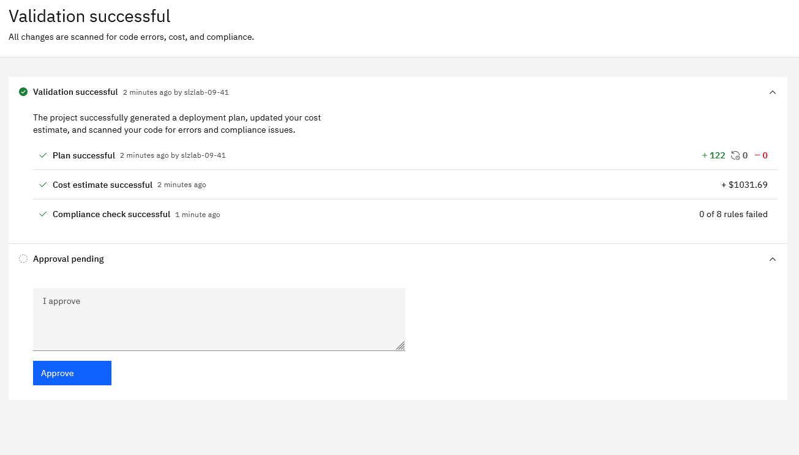
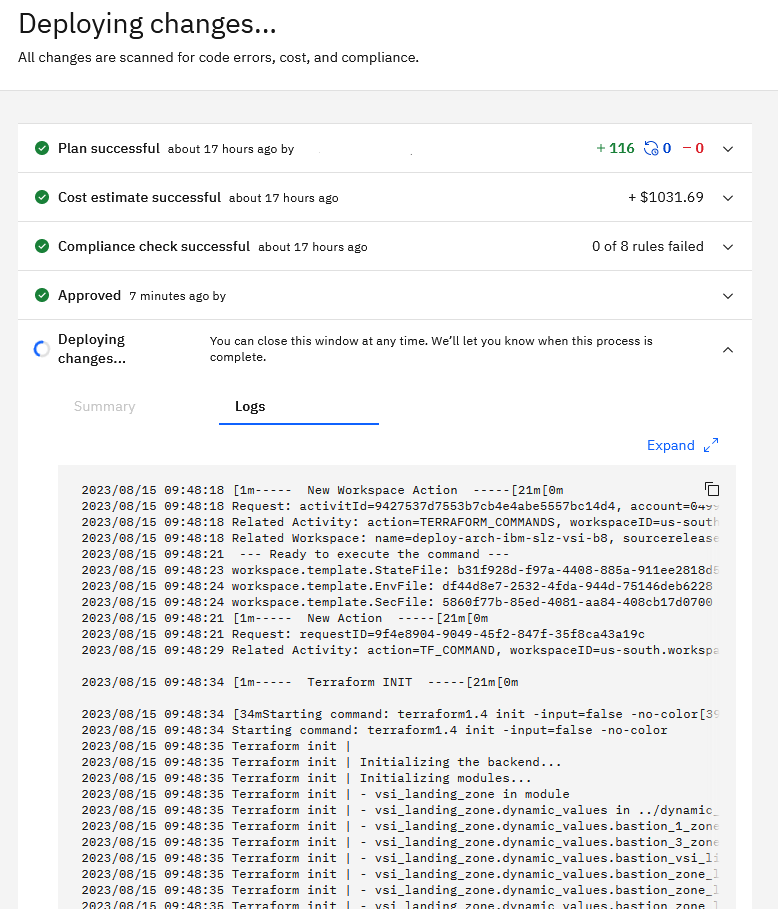

# Deploying the landing zone VSI pattern through IBM Cloud projects

1. On your computer, create an SSH key pair by issuing the following command:

    ```sh
    ssh-keygen -t rsa -b 4096 -N '' -f ./lab-key
    ```

    This command generates two files in the current directory: `lab-key` (the private key) and `lab-key.pub` (the public key.

    List the keys exist in the current directory with the following command:

    ```sh
    ls lab-key*
    ```

    If the SSH key pair succeeded, the output lists them:

    ```sh
    lab-key  lab-key.pub
    ```

1. Add the deployable architecture to a project:

    1. Access the [VSI on VPC landing zone Deployable Architecture](https://cloud.ibm.com/catalog/architecture/deploy-arch-ibm-slz-vsi-ef663980-4c71-4fac-af4f-4a510a9bcf68-global?catalog_query=aHR0cHM6Ly9jbG91ZC5pYm0uY29tL2NhdGFsb2cjcmVmZXJlbmNlX2FyY2hpdGVjdHVyZQ%3D%3D) in IBM Cloud.
    1. On the VSI on VPC landing zone details page, make sure that the following settings are selected:\
        a. Product version: **Select the latest** (`4.4.7` at the time of writing).\
        b. Variation: `Standard`

        

    1. Click **Review deployment options** on the lower right.
    1. Click **Add to project**.
    1. In **Create New**, enter a name for the project. For example, "\<your initials> landing zone lab". You can leave the other information as is.
    1. Click **Create** on the lower right.

1. Configure the project
    1. In the **Configure** > **Security** section, specify the following information: \
      a. Authentication: Clear **Use a secret** and paste in your IBM Cloud API key.

    1. In the **Configure** > **Required** section, specify the following settings:\
        a. `ssh_public_key`: The value of the `lab-key.pub` file that you generated in step 1.\
        b. `region`: The region that you want to deploy in. \
        c. `prefix`: Your initials.

        

    1. In the **Configure** > **Optional**, set the following options:\
        a. `add_atracker_route`: `false`.
    1. Click **Save**.

1. Validate and deploy the deployable architecture:
    1. Click **Validate**.

    The project runs through several validation steps. When it finishes, the validation is marked as successful. In the **Approval pending** section, add a comment and click **Approve** to start provisioning.

    

    1. Click **Deploy**

        :information_source: **Tip**: Deployment takes approximately 15 minutes to complete.

1. While you wait for the deployment to finish, consider doing these things:

    - Look at the deployment logs:
        - The Terraform init step initializes the Terraform configuration files for use with Terraform.
        - The Terraform plan steps show the list of resources that are going to be created.
        - The Terraform apply steps shows the resources that are being created.

        Example:

      

    - Go to the [VPC section](https://cloud.ibm.com/vpc-ext/vpcLayout) and the [resource list](https://cloud.ibm.com/resources) in your IBM Cloud account. Refresh the screen to see the resources that are created during deployment.
    - Explore some of the materials in the [introduction](README) to this lab.
    - Have a coffee ☕
