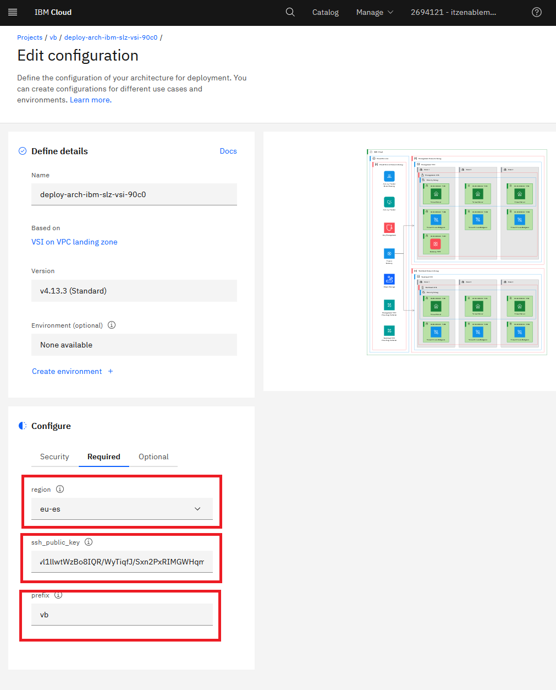

# Deploying Landing Zone VSI pattern through IBM Cloud Project

1. On your machine, create an SSH key pair via the command:
   ```
   ssh-keygen -t rsa -b 4096 -N '' -f ./lab-key
   ```
   This command generates two files in the current directory: `lab-key` (the private key) and `lab-key.pub` (the public key).
   Verify that the keys have been created in the current directory.
   ```
   ls lab-key*
   ```
   This should return:
   ```
   lab-key  lab-key.pub
   ```
2. Access the [VSI on VPC landing zone Deployable Architecture](https://cloud.ibm.com/catalog/architecture/deploy-arch-ibm-slz-vsi-ef663980-4c71-4fac-af4f-4a510a9bcf68-global?catalog_query=aHR0cHM6Ly9jbG91ZC5pYm0uY29tL2NhdGFsb2cjcmVmZXJlbmNlX2FyY2hpdGVjdHVyZQ%3D%3D)
3. On the Overview page, make sure the following is selected:\
   a. Product version: **Select the latest** (4.4.7 at the time of writting)

   b. Variation: Standard
   
4. Click **Review deployment options** on the bottom right
5. Click **Add to project**
6. Under _Create New_, input a name that you wish to provide to the project. For example "\<your initials\> Landing Zone Lab"
7. Click **Add** on the bottom right
8. Under _Configure -> Security_ section, set the following:\
   a. Authentication: untoggle _Use a secret_ and paste your IBM Cloud API key input the box

9. Under _Configure->Required_ section, set the following:\
   a. `ssh_public_key`: The value of lab-key.pub that was generated from step 1\
   b. `region`: Select a region that you wish to deploy in\
   c. `prefix`: your initials
   

10. Under _Configure-> Optional_, set the following:\
    a. `add_atracker_route`: false
11. Click **Save**
12. Click **Validate**
13. The project will go through different steps in validation. When it completes, the validation is marked as successful. In the _Approval pending_ section, add a comment and click **Approve** to start provisioning.


14. Click **Deploy**


:information_source: **Note**: The deploy will take approximately 15 minutes to complete. Some suggestions during this time:
- You may following the execution logs. Of interest:
   
   - The terraform plan steps shows the list of resources that are going to be created.
   - The terraform apply steps shows the resources that are being created.
   - You may also navigate to the [VPC section](https://cloud.ibm.com/vpc-ext/vpcLayout) and the [resource list](https://cloud.ibm.com/resources) in your account to see the resources starting to spawn up as you refresh the screen during the execution.
- Explore in more details some of the materials in the [introduction section](README)
- Coffee ☕
