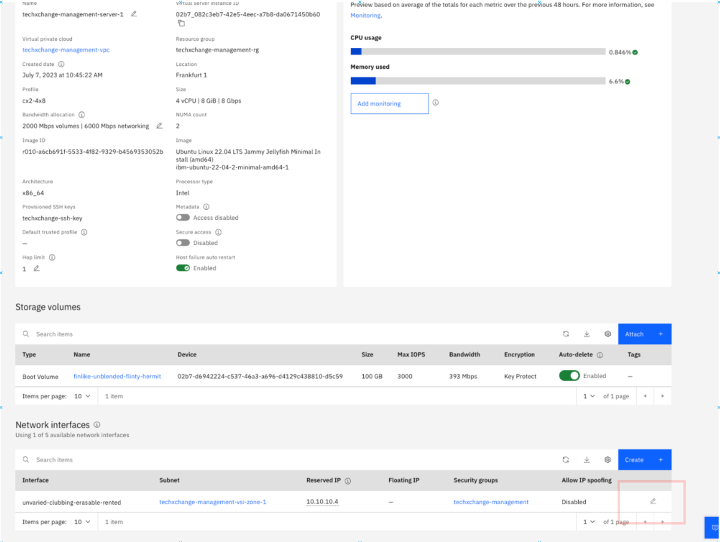
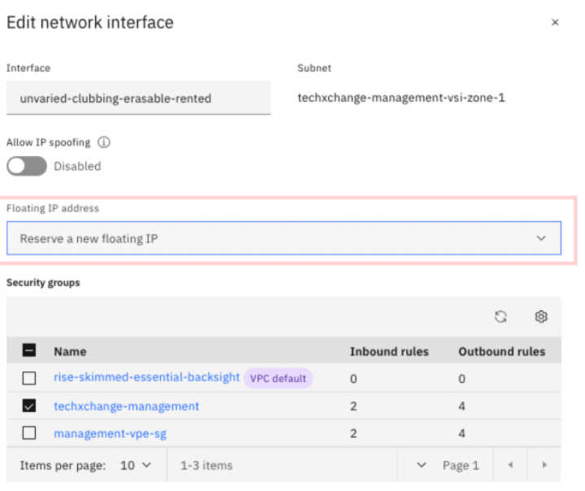
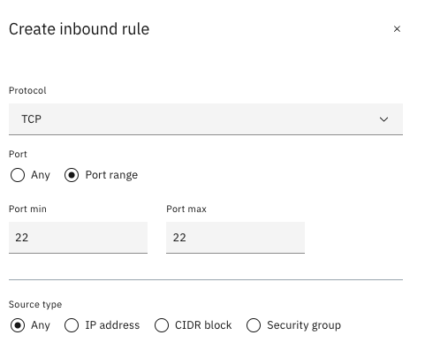
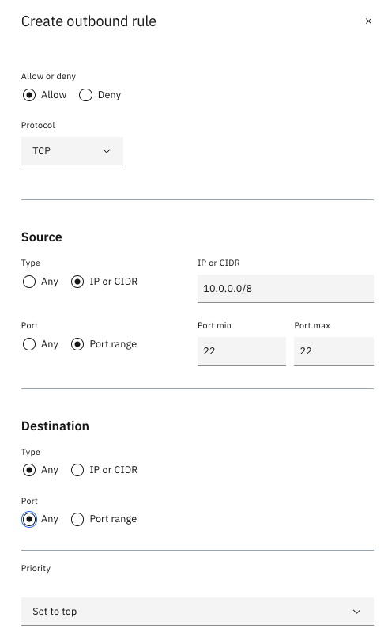

# Providing operator access to the VPC landing zone

## Overview of operator access

By default, network access to the VPC landing zone topology is locked down for security compliance reasons. In this part of the lab, you open the necessary access for an operator to access the VPC environment, including deploying application on the VSIs located in the workload VPC.

You give operator access through the _Management VPC_. You have several options to give operator access, with varying level of security, compliance, and ease of enablement.

- Exposing a VSI in the management VPC as a ‘jump-box’ by assigning a public floating IP
- Deploying a client-to-site VPN solution in the management VPC
- Deploying a site-to-site VPN solution in the management VPC
- Deploying a certified bastion solution, such as Gravitational Teleport in the management VPC.

In this lab, you expose one of the VSIs in the management VPC as a 'jump-box'. This method is one of the simplest ways to proceed, although it is not overly secure. The [Going further](./part1/50-going-further) section later in the lab provides links to some of the other ways that you can provide operator access.

## Steps

Complete the following steps to enable public SSH access to one of the VSI in the management VPC. This VSI is the unique operator entry point ('jump-box') to the landing zone VPC topology.

1. Access the [Virtual server instances for VPC list](https://cloud.ibm.com/vpc-ext/compute/vs).
2. Verify that the region is set to the region you provisioned your resources and click the VSI labeled `<your_initials>-management-server-1`.
3. Add a floating IP address by clicking the pencil icon in the Network Interface section. Reserve a new floating IP address.

    

    :exclamation: **Important**: Take note of the public floating IP address. You need it later.

    

5. Click **Save**.
6. In the [Security Groups for VPC](https://cloud.ibm.com/vpc-ext/network/securityGroups), click the one labeled `<your_initials>-management`.
7. Go to the Rules section and allow port 22 for SSH inbound access by clicking **Create** in the _Inbound rules_ section.

    :information_source: **Tip**: Security groups are stateful so you don’t need to add a corresponding outbound rule.

    

8. Click **Create**.
9. In the [Access control lists for VPC](https://cloud.ibm.com/vpc-ext/network/acl), click the one labeled `<your_initials>-management-acl`.
10. Create the following ACL inbound rule for SSH access:

    

11. Create the following ACL outbound rule for SSH access:

    

12. You can now access the 'jump-box' through the public floating IP address that you provisioned earlier. On your computer, issue the following command from the terminal or command window:

    ```sh
    ssh -i ./lab-key root@<Floating IP of Virtual server instance>
    ```

    Replace \<Floating IP of Virtual server instance> with the address that you reserved earlier.
