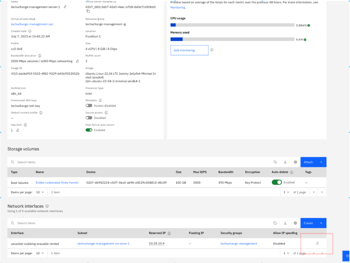
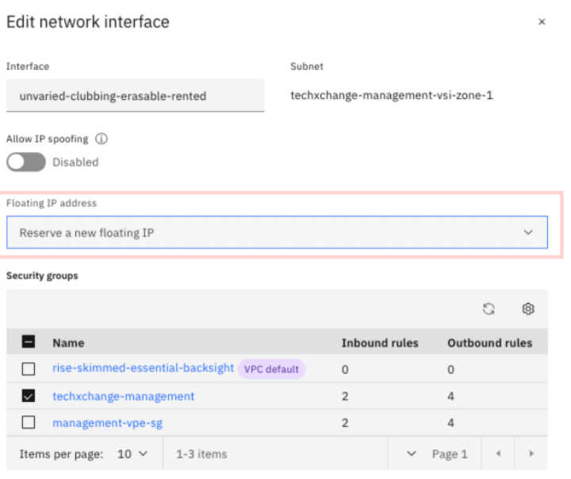
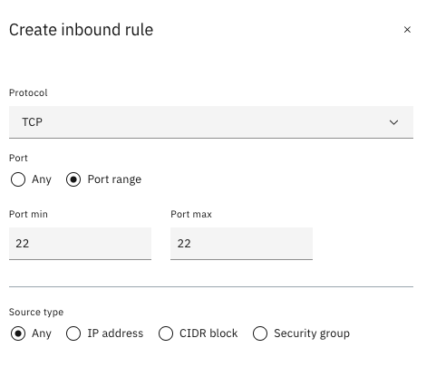
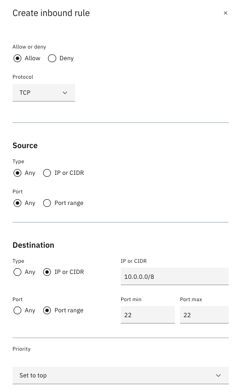
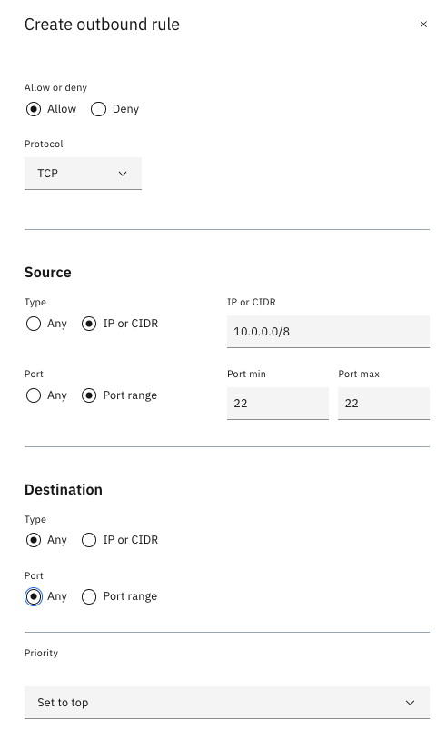

# Providing operator access to the VPC landing zone

By default, network access to the VPC landing zone topology is locked down for security compliance reasons. In this section, you will open up the necessary access for an operator to access the VPC environment, including deploying application on the VSI's located in the workload VPC.

Operator access is provided through the _Management VPC_. There are multiple ways to give operator access to the VPC landing zone, with varying level of security, compliance, and ease of enablement:

- Exposing a VSI in the management VPC as a ‘jump-box’ by assigning a public floating IP
- Deploying a client-to-site VPN solution in the management VPC
- Deploying a site-to-site VPN solution in the management VPC
- Deploying a certified bastion solution, such as Gravitational Teleport in the management VPC.

This part of the lab shows how to expose one of the VSI's in the management VPC as a ‘jump-box’, as this is one of the simplest way to proceed, albeit not being strongly secure. The Going Further section below provides links to some of the other ways to provide operator access.

Perform the following actions to provide operator access to a VSI in the management VPC

1. Access the [Virtual server instances for VPC list](https://cloud.ibm.com/vpc-ext/compute/vs)
2. Verify that the region is set to the region you provisioned your resources and click the VSI labeled _&lt;initials&gt;-management-server-1_
3. Add a Floating IP address by clicking the pencil icon in the Network Interface section and reserve a new floating IP
   

4. In the [Security Groups for VPC](https://cloud.ibm.com/vpc-ext/network/securityGroups), click the one label _&lt;initials&gt;-management_
5. Go to the Rules section and allow port 22 for inbound by clicking **Create** in the _Inbound rules_ section (Note: Security groups are stateful so you don’t need to add a corresponding outbound rule)

6. Click **Create**
7. In the [Access control lists for VPC](https://cloud.ibm.com/vpc-ext/network/acl), click the one labeled _&lt;initials&gt;-management-acl_
8. Create the following ACL inbound rule:
   
9. Create the folloiwng ACL outbound rule:
   
10. You will now be able to access the Floating IP address that you provisioned in a prior step. On your workstation, issue the following command from a terminal
    `ssh -i key root@<Floating IP of Virtual server instance>`
