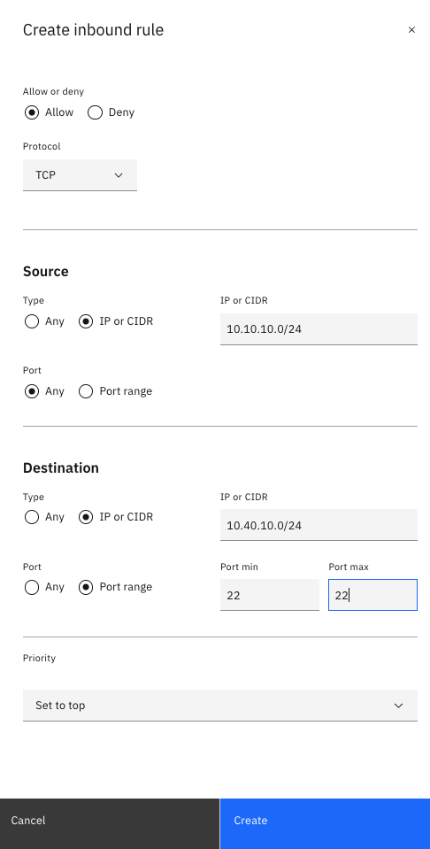
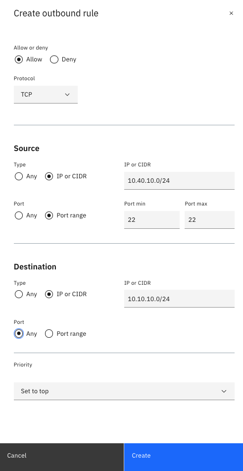
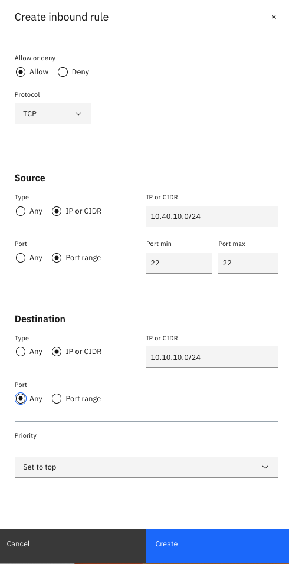
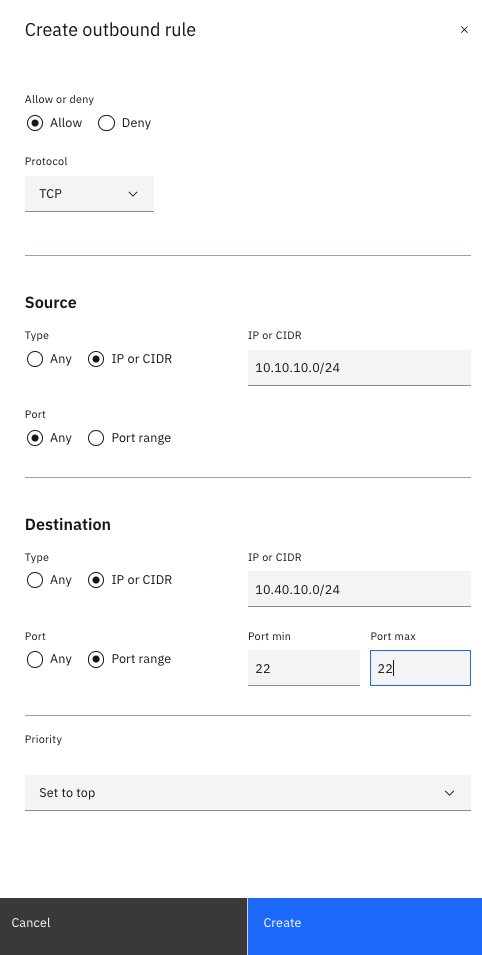
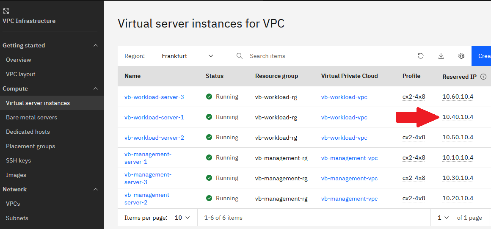

# Deploying an Apache server in the Workload VPC

In this part of the lab, you install an Apache server on a workload VSI.

By default, the workload VSI (Virtual Server Instance) is locked down from the management VPC. You need to allow access through the access control list.

1. In the [Access control list](https://cloud.ibm.com/vpc-ext/network/acl), click the ACL labeled `<your_initials>-workload-acl`.
    1. Create an ACL inbound rule to allow ssh access from the Management VPC.

        

    1. Create an ACL outbound rule to allow ssh access from the Management VPC.

        

1. In the [Access control list](https://cloud.ibm.com/vpc-ext/network/acl), click the ACL labeled `<your_initials>-management-acl`.
    1. Create an ACL inbound rule to allow ssh access from the Workload VPC.

      

    1. Create an ACL outbound rule to allow ssh access from the Workload VPC.

      

1. Access the workload VSI by completing the following steps:
    1. Go to [Virtual server instances for VPC](https://cloud.ibm.com/vpc-ext/compute/vs). Take note of the private IP("Reserved IP") for the VSI labeled `<your_initials-workload-server-1` (`10.40.10.4` in this example). You need it later.

        

    1. From your computer, copy the private key that is labeled `lab_key`` to the Bastion host.

        ```sh
        scp -i lab-key lab-key root@<Floating IP address of bastion host>:/root
        ```

   1. SSH to the bastion host

      ```sh
      ssh -i ./lab-key root@<Floating IP of Virtual server instance>
      ```

   1. Change permissions of the private key

      ```sh
      chmod 600 lab-key
      ```

   1. SSH to the workload VSI

      ```sh
      ssh -i ./lab-key root@<Private IP address of the workload VSI>
      ```

1. Install the Apache web server by issuing the following commands:

    ```sh
    apt-get update
    apt-get install apache2 --yes
   ```

1. (Optional) You can repeat steps 3 and 4 for the workload VSIs `<your_initials>-workload-server-2` and `<your_initials>-workload-server-3`
