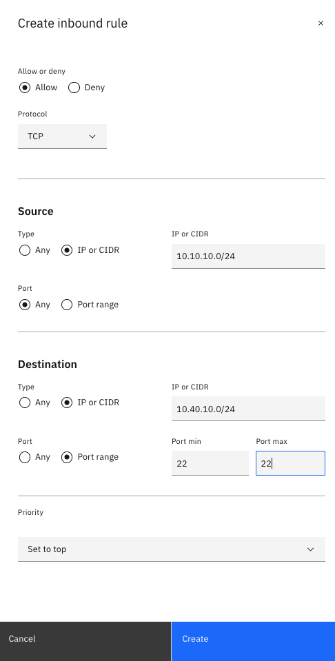
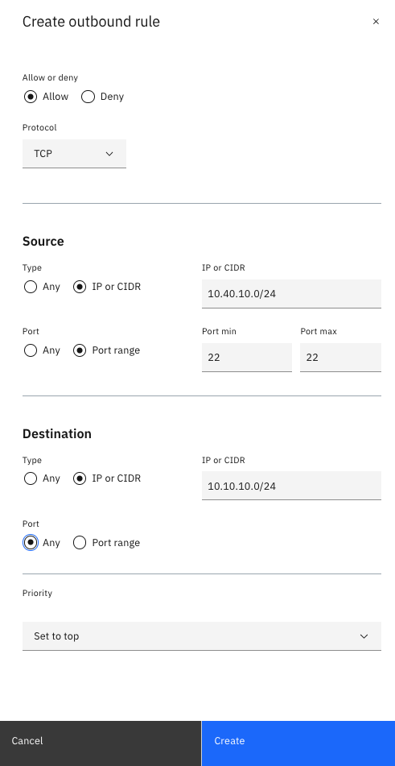
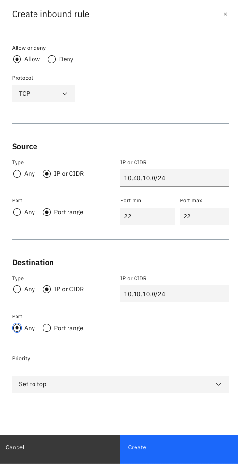
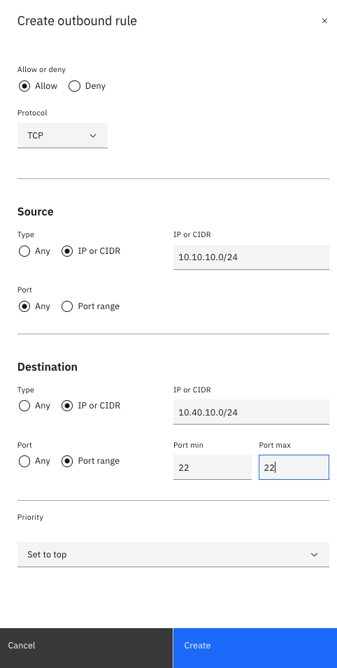

# Deploying an Apache Server in the Workload VPC

In this section, you will install the Apache server on a workload VSI.

1. By default, the workload Virtual server instances are locked down from the management VPC. You will need to allow access through the Access control list. In the [Access control list](https://cloud.ibm.com/vpc-ext/network/acl), click the ACL labeled _&lt;initials&gt;-workload-acl_.
   1. Create an ACL inbound rule to allow ssh access from the Management VPC
      
   2. Create an ACL outbound rule to allow ssh access from the Management VPC
      
2. In the [Access control list](https://cloud.ibm.com/vpc-ext/network/acl), click the ACL labeled _&lt;initial&gt;-management-acl_.
   1. Create an ACL inbound rule to allow ssh access from the Workload VPC
      
   2. Create an ACL outbound rule to allow ssh access from the Workload VPC
      
3. Access the workload VSI by doing the following:
   1. Copy the private key labeled _lab_key_ to the bastion host
      `scp -i lab-key lab-key root@<Floating IP address of bastion host>:/root`
   2. SSH to the bastion host
      `ssh -i key root@<Floating IP of Virtual server instance>`
   3. Change permissions of the private key
      `chmod 600 lab-key`
   4. SSH to the workload VSI
      `ssh -i lab-key root@<Private IP address of the workload VSI>`
4. Install the Apache web server by issuing the following commands:
   ```shell
   apt-get update
   apt-get install apache2 --yes
   ```
