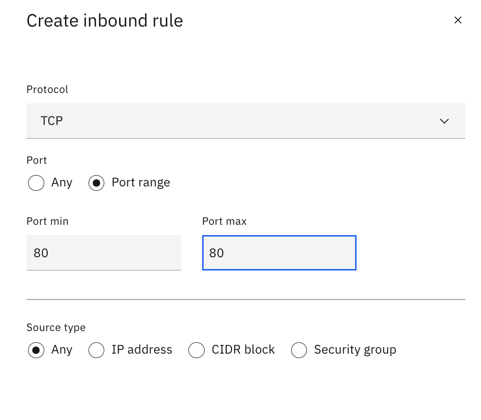
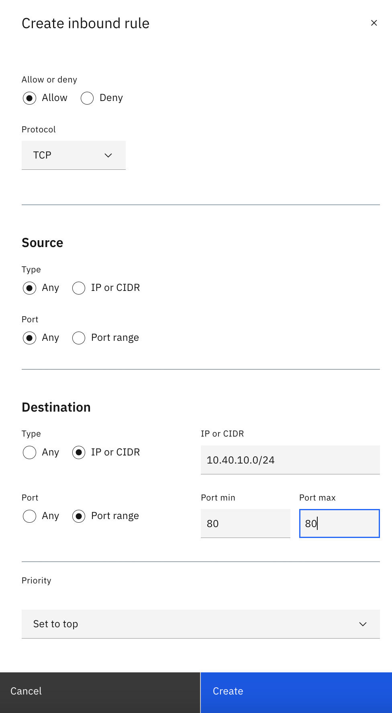
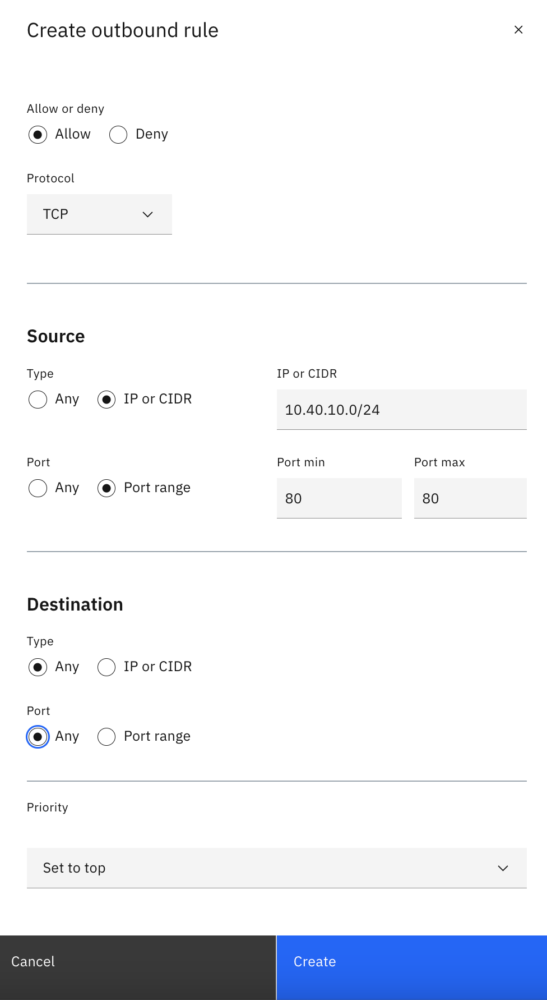

# Exposing the web application to the internet

In this section, we will expose the web pages to the internet through a VPC load balancer so anyone can access them.

1.  Create a public load balancer to expose the web application. Access the [Load balancers for VPC](https://cloud.ibm.com/vpc-ext/network/loadBalancers) page and click **Create**.
2.  Set the following for the load balancer:
    - Load balancer type: Application Load Balancer (ALB)
    - Location: Location that you provision your VPC resources
    - Details:
      - Name: &lt;initials&gt;-web-lb
      - Virtual private cloud: &lt;initials&gt;-workload-vpc
      - Type: Public
      - DNS type: Public
      - Subnets: &lt;initials&gt;-workload-vsi-zone-1
    - Backend pool:
      - Name: &lt;initials&gt;-backend-pool
      - Pool protocol: HTTP
      - Health Port: 80
    - Click **Attach server +** in the Back-end pools section and add the VSI that is in the subnet &lt;initials&gt;-workload-vsi-zone-1 with a server port of 80
    - Create a front-end listener by clicking **Create listener** and set the following:
      - Listener port: 80
    - Under the _Security Group_ section, unselect all except the one labeled &lt;initials&gt;-workload
    - Click **Create load balancer**
3.  Allow access to the load balancer by adding the following inbound rule to the [security group](https://cloud.ibm.com/vpc-ext/network/securityGroups) called &lt;initials&gt;-workload that the load balancer is attached.
    
4.  Allow internet access to the load balancer by adding the following rules to the [Access control list](https://cloud.ibm.com/vpc-ext/network/acl) for the ACL &lt;initials&gt;-workload-acl.
    - Create an inbound rule
      
    - Create an outbound rule
      
5.  It can take several minutes for your load balancer to provision. Check and wait until the status is set to Active in [Load balancers for VPC](https://cloud.ibm.com/vpc-ext/network/loadBalancers). You may need click the refresh button in the page periodically.
6.  You web application is exposed:
    - Retrieve the FQDN of your Load balancer
      - [Access the Load Balancer list](https://cloud.ibm.com/vpc-ext/network/loadBalancers) and click your provisioned load balancer
      - Copy the value under _Hostname_
    - On your machine, open up a web browser pointing to `http://<Hostname of your load balancer>` . You may also test connectivity by issuing the following command:
      `curl http://<Hostname of your load balancer>`
