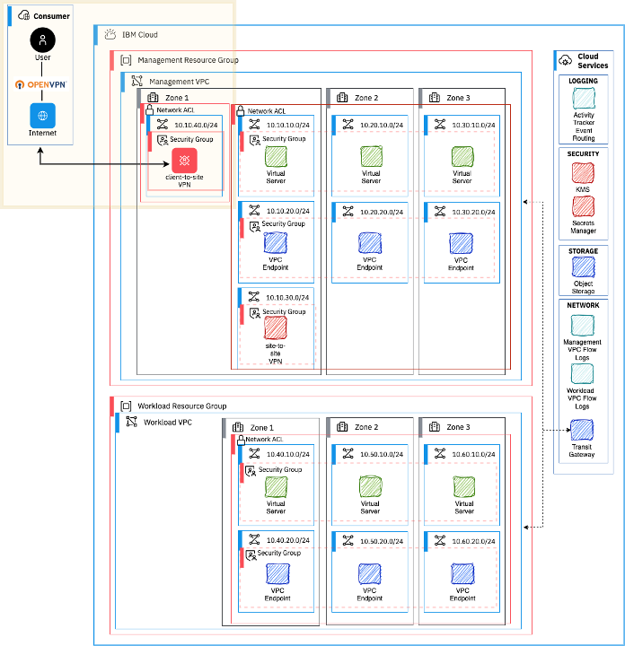

# Going further

To keep the lab simple, you give operator access through a VSI jump-box in the management VPC. Then you expose the web application directly through a public load balancer that is attached to the worker VPC.

These approaches may be sufficient for a number of industries and enterprises. However, if you want more security and need to comply with different controls, consider the following information to set a more secure and compliant posture.

## Other ways to provide operator access

Some secure options to consider for providing network connectivity to the management VPCs.

- A Client-To-Site VPN, in which the operator has a VPN client on the environment that connects to a VPN server that is running the management VPC. IBM Cloud provides a default [client-to-site VPN solution](https://cloud.ibm.com/docs/vpc?topic=vpc-vpn-client-to-site-overview) that can be used for this purpose. For an example of automation to deploy a client-to-site gateway in a landing-zone management VPC, see [Client-To-Site VPN add-on for landing zone](https://github.com/terraform-ibm-modules/terraform-ibm-client-to-site-vpn/tree/main/extensions/landing-zone).

    
- A [site-to-site VPN](https://cloud.ibm.com/docs/vpc?topic=vpc-using-vpn) to connect the management VPC to another private network. The landing zone deployable architecture creates a site-to-site gateway for this purpose.
- Direct Link, which extends an organization data center network. For a starting point with more details, see [Connecting application provider to the management VPC](https://cloud.ibm.com/docs/framework-financial-services?topic=framework-financial-services-vpc-architecture-connectivity-management).

From a compliance perspective, record all interactive operator actions with a bastion solution. Operators connect through the bastion, which records all interactive session actions for auditing. For more information, see [Running operator actions through a bastion host
](https://cloud.ibm.com/docs/framework-financial-services?topic=framework-financial-services-vpc-architecture-connectivity-bastion) in the IBM cloud Framework for Financial Services docs. For a tutorial that uses the 3rd-party solution Teleport, see [Setting up a bastion host that uses Teleport](https://cloud.ibm.com/docs/framework-financial-services?topic=framework-financial-services-vpc-architecture-connectivity-bastion-tutorial-teleport).

## Other ways to expose the web application to the internet

In the lab, the workload is exposed through a public VPC load balancer that is attached to the workload VPC. With the following additions, you can make the solution more secure.

1. Create the public VPC load balancer in a separate edge VPC. Route the traffic from the edge VPC to the application that is running on the workload VPC through a private load balancer (which is routable only from within the VPC topology). This approach ensures that no direct public network flows to the workload VPC. For more information, see [Connecting from public internet](https://cloud.ibm.com/docs/framework-financial-services?topic=framework-financial-services-vpc-architecture-connectivity-workload#consumer-provider-public-internet) in "Consumer connectivity to workload VPC".

2. Introduce a web application firewall in the flow in one of two ways:
- As-a-service: Typically, you add a global load balancer, such as IBM Cloud CIS or Akamai, in front of the VPC load balancer. Then, you add a network ACL on the VPC load balancer to accept inbound traffic only from the global load balancer set of known IP addresses.
- Hosted: You can host the application with a 3rd-party solution, such as BigIP F5. This solution is deployed and hosted on servers that you run, for example in VSIs in the landing-zone VPC topology. For a tutorial, see [Setting up a web application firewall with F5 BIG-IP](https://cloud.ibm.com/docs/framework-financial-services?topic=framework-financial-services-vpc-architecture-connectivity-waf-tutorial).

