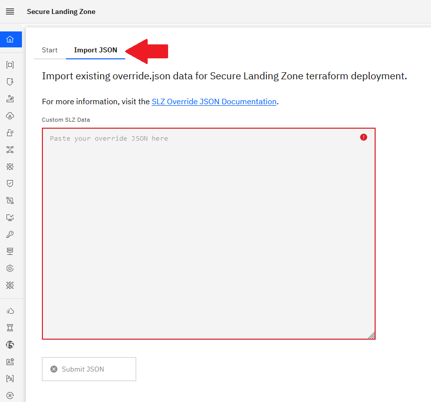

# Customizing the landing zone topology

## Overview of the landing-zone customization options

The Landing Zone module is designed to enable both lightweight and deep
customizations of the VPC topology, inclusive of all associated
services that are deployed to make the VPC topology compliant. In a nutshell, there are
two ways the topology can be customized:
1.  By using Terraform input variables. The module exposes over 70 input
    variables that can be used to tweaks aspects of the VPC topology
    that is deployed. See them as "knobs" that you can turn to slightly
    adjust the desired VPC topology.
2.  By using a json definition, which enables deeper and
    broader types of customizations. The Landing Zone module accepts a json input in the form of a file or through a string containing a json definition. Using a json definition, you can fully
    customize all aspects of the topology, beyond the use of the
    Terraform input variables.

## Defining our custom topology with a json definition

In this lab, we are going to use the json-based approach to define a
topology that matches the manual steps followed in lab 1 of the
lab. Starting from the definition for the standard VSI landing zone pattern as a starting point, we make the following customizations:
-   Expose one of the VSI in the management VPC through a public floating IP -- this is our "jump box".
-   Add a public VPC load balancer serving public http traffic and distribiting requests to the VSIs in the workload VPC
-   All necessary adjustments to the network ACL and security group to accommodate inbound and outbound traffic to the management jump box (ssh access) and the workload (http).

### Creating the json definition 

There are three ways to produce a json definition that codify the desired
topology -- ranked by order of complexity:
1.  The first way is to use the Graphical User Inferface tool provided
    at
    <https://slz-gui.15z7evpngrsf.us-south.codeengine.appdomain.cloud/>
    to guide your through a step-by-step documented wizard leading to
    the produce a valid JSON file. The GUI tool also allows you to
    import an existing json file and start customizations from there.
    
2.  The second way is to start making customization through the
    terraform input variable. The Landing Zone module has got one output
    named "config" that contains a JSON definition that includes the
    customizations made through the terraform input variables. From that
    point, you can make further customization manually or through the
    GUI tool mentioned above.
3.  The third way is to start from a copy of the json definition of one
    of the 4 patterns provided out-of-the-box with the Landing Zone
    module [here](https://github.com/terraform-ibm-modules/terraform-ibm-landing-zone/tree/main/patterns)
    . For example, the JSON file for the standard VSI-based Landing Zone
    is located under the [vsi directory](https://github.com/terraform-ibm-modules/terraform-ibm-landing-zone/blob/main/patterns/vsi/override.json). From that point, make customization to the copy of that JSON file
    either through the GUI or manually.

### Creating the json definition

In this lab, we provide the JSON file containing those customizations
[here](https://github.com/IBM/infra-to-app-with-landing-zone/blob/main/custom-slz/override.tftpl) .

?> _TODO_ ensure the gui is updated before the lab

You may take a few moment to explore the content of the provided json definition:
  1. Import the json definition in the Graphical User Inferface tool provided at <https://slz-gui.15z7evpngrsf.us-south.codeengine.appdomain.cloud/>. 
  2. Click the Import JSON button and copy paste the content of the JSON definition.
  
  3. After import, you can use the GUI to explore the various facet of the topology using the right-hand menu. Of particular interest in the scope of the customizations are the [VPC Access control](https://slz-gui.15z7evpngrsf.us-south.codeengine.appdomain.cloud/nacls), [Security Groups](https://slz-gui.15z7evpngrsf.us-south.codeengine.appdomain.cloud/securityGroups), and [Virtual Server Instances](https://slz-gui.15z7evpngrsf.us-south.codeengine.appdomain.cloud/vsi) sections. 

