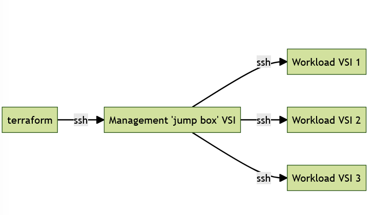

# Add the Apache server deployment logic in the Terraform module

## Objective

This step adds the automation to deploy an Apache server on the three workload virtual servers.

To implement this automation, we use the built-in Terraform [remote-exec](https://developer.hashicorp.com/terraform/language/resources/provisioners/remote-exec) provisioner. The remote-exec provisioner connects to a remote resource and invokes a script on that computer.

We configure the remote-exec provisioner to run a script that installs the Apache server on a worker VSI. The remote-exec provisioner is configured to access the worker nodes through our management jump box that is publicly exposed. The same private SSH key is used to connect both to the jump box and to the worker VSIs.



## Execute the Apache deployment logic 

You can find the code for this step in the [lab/step2](https://github.com/IBM/infra-to-app-with-landing-zone/tree/main/lab/step2) directory. The directory contains the following important files:

- The [apache.tf](https://github.com/IBM/infra-to-app-with-landing-zone/blob/main/lab/step2/apache.tf) file which contains the terraform logic calling the remote-exec provisioner with the 'right' parameters.
   
    Notice the following settings in the `apache.tf` file:

    - In the connection block, the `bastion_host` is set to the management server floating IP address that you will use as a jump host to connect to the workload server.
    - In the connection block, the `host` is set to the IP address of the workload server.
    - In the provisioner block, a list of the commands that will be executed on the workload server are listed.

    ```hcl
    resource "null_resource" "application-install" {
      count = var.number_vsi_workload
      connection {
        type         = "ssh"
        user         = "root"
        bastion_host = var.floating_ip_address
        host         = local.workload_ip_list[count.index]
        private_key  = var.ssh_private_key
        agent        = false
        timeout      = "15m"
      }

      provisioner "remote-exec" {
        inline = [
          "apt-get update",
          "apt-get install apache2 -y"
        ]
      }
    }
    ```

To run the Terraform module in your local environment, follow these steps.  These steps assume you ran the steps in ([Executing the landing zone with a JSON definition](./part2/20-custom-module)).

1.  Copy the apache.tf file from the lab/step2 directory to the `custom-slz` folder

    ```sh
    cd ~/infra-to-app-with-landing-zone/
    cp lab/step2/apache.tf custom-slz
    ```

2.  Initialize Terraform.

    ```sh
    terraform init --upgrade
    ```

3.  Generate a plan. The plan lists of resources that are going to be created. 
    - If you ran the optional `terraform apply` step in [Executing the landing zone with a JSON definition](./part2/20-custom-module), then the plan shows only the new resources related to the creation of the Apache server.
    - Otherwise, the plan shows the all of the resources related to the creation of the infrastructure in additional to the resources related to the Apache server.

  ```sh
  terraform plan -var=region=eu-gb -var=ssh_key="$(cat ./lab2-key-tf.pub) -var=ssh_private_key="$(cat ./lab2-key-tf)" -var=prefix=<your_initials>-lab2
  ```


4.  (Optional) Apply the changes.

This step might take up to 15 minutes to complete. You can skip it if you’re short on time. The automation is run through the catalog onboarding in a later step of this lab.

  ```sh
  terraform apply -var=region=eu-gb -var=ssh_key="$(cat ./lab2-key-tf.pub) -var=ssh_private_key="$(cat ./lab2-key-tf)" -var=prefix=<your_initials>-lab2
  ```