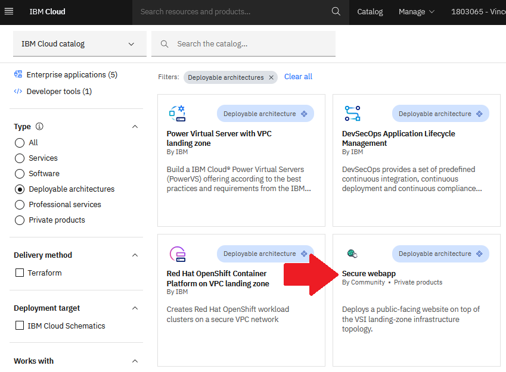
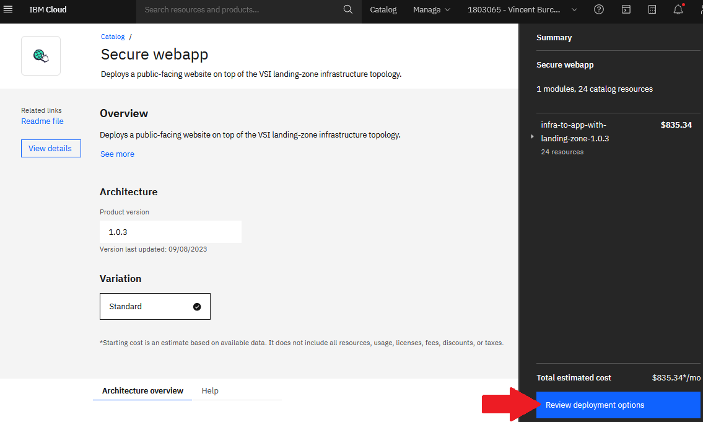
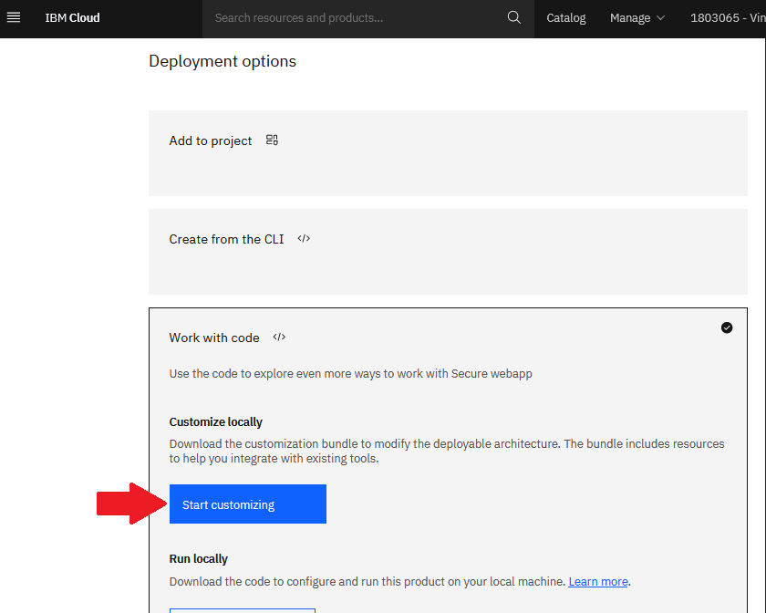
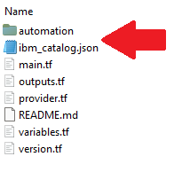

# Going further

## Automating onboarding of new versions to catalog

This lab focuses on onboarding the deployable architecture through the IBM Cloud catalog UI as a learning exercise.

It can be tedious to use the catalog UI to support the lifecycle of several deployable architectures as new versions are produced. After the initial version onboarding, IBM Cloud Catalog provides starter scripts that help you automate the catalog onboarding steps. The scripts build a pipeline that pushes new versions of a deployable architecture from GitHub or GitLab to the IBM Cloud catalog and trigger the catalog validation. The starter scripts use GitHub actions and the tekton toolchain and are available through the following steps:
  1. Open your tile in [IBM Cloud Catalog](https://cloud.ibm.com/catalog).

  

  2. Select **Review deployment options** on the bottom right. 

  

  3. Under **Work with code**, click **Start customizing**. Upon clicking the button, a download of a tar.gz archive file is initiated.

  

  4. In the downloaded archive:
    1. The `ibm_catalog.json` file is a json file containing all of the information that were inputed from the catalog onbording UI. You may check it in your source control.
    2. The `automation` folder contains the started scripts to build a pipeline to automate the onbording of future version of the deployable architecture. 

  

## Using curated building blocks for your deployable architecture

The [IBM Cloud Terraform modules](https://github.com/terraform-ibm-modules) GitHub organization contains curated Terraform modules that you can use as building blocks in your solution to provision and configure some of the most common IBM Cloud services. The modules are designed to cover the most common uses cases and provide guidance and secure-by-default configurations (typically in the `profiles/fscloud` directory of the module).

The following [list](https://github.com/topics/core-team?l=hcl) contains the modules that are actively maintained, supported, and kept current by IBM Cloud.

If you need to create some IBM Cloud services in your solution, consider using these curated modules rather than coding against the IBM Cloud Terraform provider resources directly. The modules are higher level and can save you time, and they provide assurance that the configuration is tested and maintained by IBM.

## Best practices to implement deployable architectures

For recommendations and best practices about implementing quality Terraform modules, see the [terraform-ibm-modules](https://terraform-ibm-modules.github.io/documentation/#/implementation-guidelines) documentation. A [module template](https://github.com/terraform-ibm-modules/terraform-ibm-module-template) is also available that you can use to get started quickly creating your own module.

## Making a deployable architecture available in the IBM Cloud public catalog.

If you are a partner or vendor that is interested in making a deployable architecture available in the public IBM Cloud catalog, see [Selling on IBM Cloud](https://cloud.ibm.com/docs/sell?topic=sell-selling-clouds).
